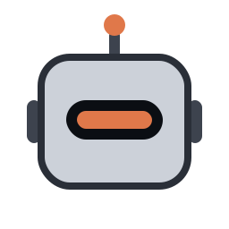
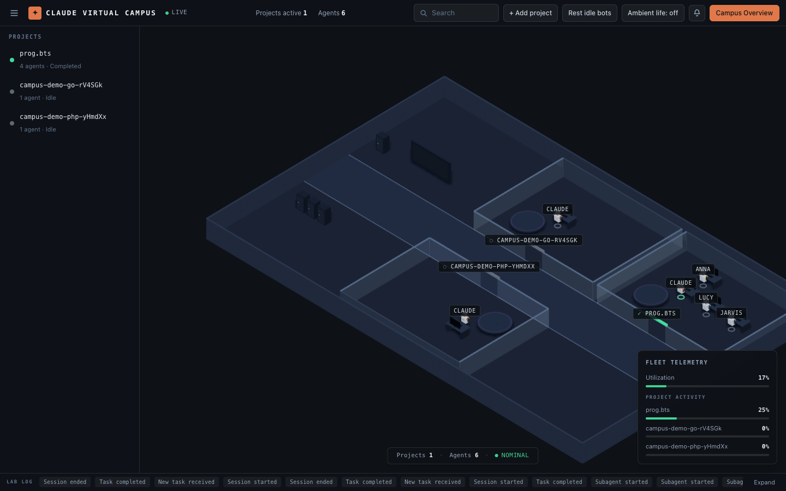
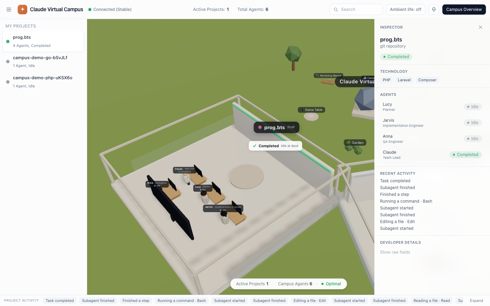
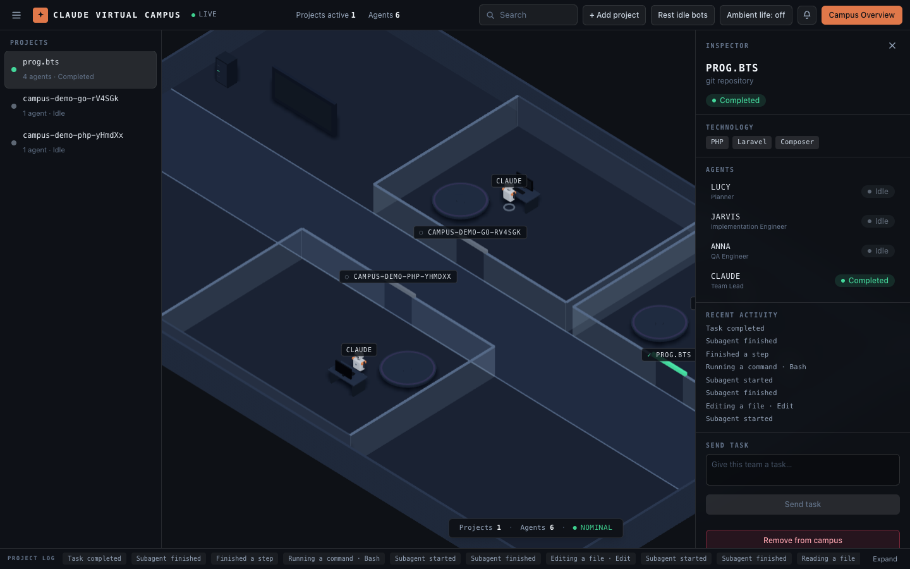
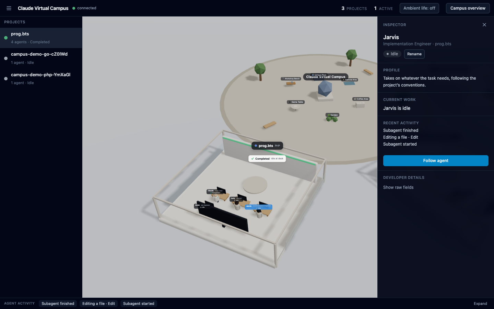
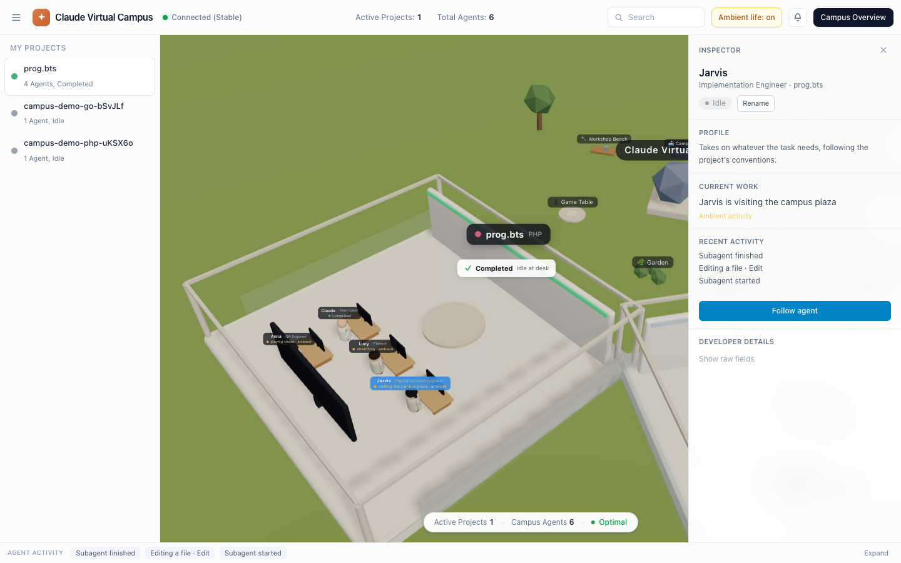

<p align="center">
  
</p>

# Claude Virtual Campus

Mission control for your Claude Code projects.

Every local project becomes a glass-partitioned bay in a dark ops lab. Claude and its real
subagents appear as named robots — planning, working, checking and reviewing in real time.
Each robot's lit visor carries its live status, and the fleet telemetry panel is derived
from real hook events, never faked.



**Local-first · Multi-project · Multi-agent · Language-agnostic · Real-time 3D**

---

## What it is

Open Claude Code inside any project, give it a task, and the lab lights up: it detects
the project, gives it a bay, and moves named robot agents as Claude actually works. It
works with **any** language — PHP, Python, Go, Rust, Java, .NET, Ruby, Node.js or anything
else — because it watches Claude Code's hooks, not your build system. Nothing is scripted:
every movement is driven by a real hook event.



## Key features

- **A bay per project.** Each local project you connect gets its own persistent bay.
- **Real named agents.** Main Claude plus the actual subagents Claude starts, as robots
  with name-only nameplates; role, bio and live state live in the inspector.
- **Live 3D activity.** Robots glide between the planning table, their console and the
  review wall as hook events arrive; the visor color is the status.
- **Send tasks.** Give a bay a task from its inspector — a headless Claude run executes it
  in that project directory (loopback-guarded; see Security).
- **Standby, not theater.** Idle robots hold station. Optional ambient idle life exists but
  is off by default, always labelled, never mistaken for real work.
- **Approval flow.** Destructive commands pause the agent and ask for permission.
- **Night-ops UI.** Dark isometric lab, per-project bays, live fleet telemetry and an
  at-a-glance status pill — all derived from real state, never faked.
- **Language-agnostic.** Zero assumptions about frameworks, package managers or `src/`.
- **Local-first & safe.** Observes hooks; never executes code it merely observes.

## 60-second quick start

Already have the campus cloned and installed? Two terminals:

```bash
# terminal 1 — start the campus
cd ~/Developer/claude-virtual-campus
pnpm db:up
pnpm dev
```

```bash
# terminal 2 — connect a project (one-time: put `campus` on your PATH)
cd ~/Developer/claude-virtual-campus && pnpm campus:link

cd ~/Developer/my-project
campus install
```

```bash
# then just use Claude Code as usual
cd ~/Developer/my-project
claude
```

Open **http://localhost:3100**, give Claude a task, and watch the project room come alive.
Keep `pnpm dev` running the whole time.

## Full installation

```bash
git clone <repository-url>
cd claude-virtual-campus

pnpm install
cp .env.example .env

pnpm db:up
pnpm db:migrate
pnpm dev
```

- Web: **http://localhost:3100**
- API: **http://localhost:4000**

`pnpm dev` runs both apps and must stay running. Requirements: Node.js ≥ 20 and Docker
(for Postgres). More in [docs/development.md](docs/development.md).

## Run with Docker (no `pnpm dev`)

To keep the campus running in the background without a dev server, run the whole stack —
Postgres, API and web — in containers:

```bash
docker compose up -d --build
```

- Web: **http://localhost:3200**
- API: **http://localhost:4000**

The API container applies database migrations on start, and all three services use
`restart: unless-stopped`, so the campus comes back automatically after a reboot. Every
port is published on `127.0.0.1` only — nothing is reachable from the LAN. Your home
directory is mounted into the API container so project identity resolves exactly as on the
host (same git repos, same paths).

**Sending tasks from the dockerized stack** needs credentials the macOS keychain can't
provide to a container. Generate a long-lived token once (free, uses your existing
subscription login) and put it in `.env`:

```bash
claude setup-token                       # browser login, prints a token
echo 'CLAUDE_CODE_OAUTH_TOKEN=<token>' >> .env
docker compose up -d api
```

Without the token the dashboard works fully; only "Send task" runs fail (honestly, as
`FAILED — Not logged in`). Prefer zero setup? Use the host stack (`pnpm dev`, port 3100):
runs then spawn your local `claude` with its normal credentials. Run one stack at a time —
they share port 4000.

Manage the containers with the usual commands:

```bash
docker compose ps          # status
docker compose logs -f     # follow logs
docker compose down        # stop everything
docker compose up -d --build   # rebuild after you change the source
```

You still connect projects the same way (`campus install`); the hooks reach the API
at `http://localhost:4000`.

## Connect a project

Once per machine, put the `campus` command on your PATH:

```bash
cd ~/Developer/claude-virtual-campus && pnpm campus:link
```

After that, connect any project — any language — by running one command **inside it**, with
no path and no pnpm:

```bash
cd ~/Developer/laravel-shop && campus install
cd ~/Developer/python-worker && campus install
cd ~/Developer/go-service && campus install
```

`campus install <path>` also works if you'd rather pass the directory explicitly (paths with
spaces are fine). Prefer not to touch your PATH? Run it by its full path —
`~/Developer/claude-virtual-campus/bin/campus install` — or use `pnpm campus:install <path>`
from inside the campus repo. All three call the same installer.

What the installer does — and does not do:

- It modifies **only** the project's `.claude/` directory.
- It does **not** modify your application source code.
- It does **not** modify `package.json`, `composer.json`, `pyproject.toml` or `go.mod`.
- Installation is required **once** per project; afterwards you just run `claude` normally.
- The room appears after the first Claude hook event, and stays visible after the session
  ends.

To remove it, from inside the project:

```bash
campus uninstall
```

## Daily usage

1. Start the campus (`pnpm dev`) and open http://localhost:3100.
2. Run `claude` inside any connected project and give it a task.
3. Watch its room: the agent moves to the planning table, then to its desk to work, then to
   the review screen to check, and celebrates when the task completes.
4. Click a room or an agent to open the inspector for details; double-click an agent to
   follow it.

## Multi-agent rooms

A room can hold the main Claude plus the real subagents Claude starts, for example a
Planner, an Implementation Engineer and a QA Engineer working together.



> The campus does not invent working agents. It visualizes the real agents Claude Code
> starts.

Each teammate gets a stable desk and keeps its identity across restarts and reconnects
(subagents are keyed on session + type, so re-running the same kind of subagent reuses the
same teammate instead of duplicating it). Unknown subagent types still get a safe role and
profile.

### Work as a coordinated engineering team

To see several teammates, ask Claude to split the work:

> Use a **Planner** subagent to inspect the request and define a plan.
> Use an **Implementation Engineer** subagent to make the changes.
> Use a **QA Engineer** subagent to run tests and verify the result.
> Use a **Reviewer** subagent to inspect the final implementation.

Keep responsibilities separate and let Claude coordinate the final result. Multiple avatars
appear **only** when Claude actually starts multiple subagents.

## Named agents

Every agent has a stable, human-readable name — never `agent-123` or `general-purpose-2`.
Main Claude appears as **Claude — Team Lead**; subagents get names from a curated pool
(Lucy, Jarvis, Anna, Milo, …), assigned deterministically with no duplicates in a room.



Open an agent to see its **name, role, short bio, current state and observable action**,
plus **Follow** and **Rename**. Renames persist across restarts, and "Reset name" restores
the generated name. Raw ids stay tucked inside the collapsed **Developer details**.

Roles the campus recognizes include Planner, Researcher, Implementation Engineer, Frontend
/ Backend / Database Engineer, QA Engineer, Reviewer, Security Reviewer, DevOps Engineer and
Documentation Agent — the role shows as colored shoulder markings on the robot (main Claude
wears the copper antenna). In-scene nameplates stay name-only; everything else is in the
inspector.

### Optional team roster

Pre-label the teammates a project will start with `<project>/.claude/campus.json`:

```json
{
  "projectName": "prog.bts",
  "team": [
    { "agentType": "plan", "name": "Lucy", "role": "Planner" },
    { "agentType": "implementation-engineer", "name": "Jarvis", "role": "Implementation Engineer" },
    { "agentType": "qa-engineer", "name": "Anna", "role": "QA Engineer" }
  ]
}
```

This controls presentation only — it grants no permissions and creates no working agents.
Scaffold a starter file by running `campus team` inside the project.

## Standby and ambient life

An idle robot holds station at its console — dim visor, steady hover. That's the default:
a serious lab, no theater. Two optional cosmetic layers exist on top:



- **Rest** ("Rest idle bots" in the top bar) powers idle robots down in place; any real
  Claude activity wakes them instantly.
- **Ambient life** (top-bar toggle, **off by default**) lets genuinely idle robots wander
  the lab. It starts only while an agent is idle, stops the instant a real event arrives,
  never creates Claude events or tasks, is frozen while an approval is pending, and
  respects your OS reduced-motion setting. In the inspector it is always labelled as
  ambient, never as real work.

## Architecture

```text
Claude Code CLI → universal hooks → NestJS event API → Postgres
                                          → Socket.IO → Next.js + React Three Fiber
```

The campus is a pnpm/Turbo monorepo (NestJS API, Next.js 3D web, shared pure packages for
project inspection and event normalization). Full detail, the data-flow diagram and the
module boundaries are in [docs/architecture.md](docs/architecture.md).

## Security

The campus observes hooks and **never executes code it observes**. Secrets are redacted
before anything is stored or shown, the API is local-only, destructive commands route
through an approval flow that defaults to **deny** on timeout, and the hooks fail open so
Claude Code keeps working if the campus is down.

The one thing that *does* execute code — the "Send task" runs endpoint — is refused on
non-loopback binds unless `RUNS_ALLOW_NONLOOPBACK=1`. Only docker-compose.yml sets that,
and it may because it also publishes every port on `127.0.0.1`: "reachable" still means
"this machine". See [docs/security.md](docs/security.md).

## Troubleshooting

| Symptom | Fix |
|---|---|
| Project does not appear | run `campus install` in it (or `pnpm campus:install <path>`), then run `claude`; check `curl http://localhost:4000/api/health` |
| Only Claude appears | The task started no subagents — use the multi-agent prompt above |
| `runs are disabled on non-loopback binds` | Interactive runs need loopback: use the host stack (`pnpm dev`), or the Docker stack with `CLAUDE_CODE_OAUTH_TOKEN` set (see the Docker section) |
| Send task fails `Not logged in` | Container has no credentials — `claude setup-token`, add it to `.env`, `docker compose up -d api` |
| CORS errors in devtools | Open the URL your stack actually serves (host `:3100`, Docker `:3200`); `CORS_ORIGIN` accepts a comma-separated list of allowed origins |
| Database unavailable | `pnpm db:up && pnpm db:migrate` |
| Campus offline | Claude Code keeps working; hooks fail open |

More cases in [docs/troubleshooting.md](docs/troubleshooting.md).

## Development commands

```bash
pnpm dev            # web (:3100) + api (:4000)
pnpm lint           # eslint across all workspaces
pnpm typecheck      # tsc --noEmit across all workspaces
pnpm test           # unit + integration tests (needs the database up)
pnpm build          # production build
pnpm test:e2e       # full-stack smoke test (stop `pnpm dev` / `docker compose stop api web` first)
pnpm screenshots    # regenerate docs/images/*.png from a real browser
```

Full development guide: [docs/development.md](docs/development.md).
Hooks and the hook-event mapping: [docs/hooks.md](docs/hooks.md).

## Roadmap

- Per-module room splitting (modules currently share the repo's room).
- Broader command-classifier coverage as new tools come up.
- Richer robot idle animations for the optional ambient layer.
- Visual regression testing for the 3D scene.
