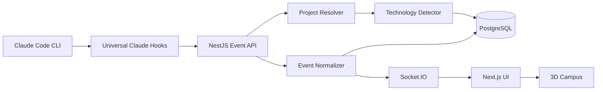

# Claude Virtual Campus

A local-first, browser-based 3D office that visualizes real Claude Code activity across
any number of software projects -- PHP, Python, Go, Rust, Java, .NET, Ruby, C/C++,
Elixir, Node.js, or anything else. Every monitored project gets its own persistent 3D
room with a main Claude agent, subagents, and stations (research, testing, build,
review, database, infrastructure, terminal, approval, task board), all driven by real
Claude Code hook events -- never scripted demo animation.

## 1. Product overview

Open Claude Code inside any project, give it a task, and Claude Virtual Campus:

1. Detects which project the event came from (git-based identity, or path-based for
   non-git directories).
2. Detects its technology stack (without requiring it, and without running anything).
3. Creates or activates that project's room.
4. Creates/updates the session and resolves which agent produced the event.
5. Normalizes the event into a language-agnostic activity + office zone.
6. Moves the corresponding 3D agent and displays observable work details.
7. Persists sanitized activity history and returns agents to idle when done.

## 2. Architecture



Monorepo layout:

```text
apps/
  api/     NestJS backend: event pipeline, Prisma/Postgres, Socket.IO gateway
  web/     Next.js + React Three Fiber frontend
packages/
  contracts/          zod schemas, shared TS types, shared 3D layout constants
  project-inspector/  git identity resolution + technology detection (pure)
  event-normalizer/   command/file classification, redaction, normalization (pure)
  claude-plugin/      hook scripts + installer/uninstaller
  config-eslint/      shared eslint config (published as @campus/eslint-config)
  config-typescript/  shared tsconfig base
scripts/
  demo-events.ts   PHP/Python/Go simulators over the real HTTP endpoint
  e2e-smoke.ts     full-stack smoke test
```

See `CLAUDE.md` for architectural rules and the hook-event mapping caveat.

## 3. Installation

Requirements: Node.js >= 20, Docker (for Postgres). pnpm is installed automatically via
Corepack.

```bash
git clone <this repo>
cd claude-virtual-campus
corepack enable
cp .env.example .env
pnpm install
```

## 4. Database startup

```bash
pnpm db:up        # docker compose up -d postgres (host port 5433, to avoid clashing
                   # with any other local Postgres on 5432)
pnpm db:migrate    # apply Prisma migrations
```

## 5. Development commands

```bash
pnpm dev           # starts web (:3100) and api (:4000)
pnpm build         # production build of every package/app
pnpm lint          # eslint across all workspaces
pnpm typecheck     # tsc --noEmit across all workspaces
pnpm test          # unit + integration tests across all workspaces
pnpm test:e2e      # full-stack smoke test (starts its own db/api/web)
pnpm test:redesign # headless-browser smoke: drives the UI, writes artifacts/redesign/*.png
```

### The campus at a glance

The 3D world shows open **project studios** ringed around a central hub. Each studio has
one planning table, agent desks (the monitor tint shows the work kind), one shared review
screen and a status wall — not a station per backend event. Detailed backend activity is
mapped on the frontend (`apps/web/selectors/`) into five visual states so agents move on
meaningful phase changes rather than on every tool call:

| Visual state | Backend activity (examples) | Where the agent goes |
|---|---|---|
| Planning | UserPromptSubmit, planning, meeting | planning table |
| Working | Read/Grep/Edit/Write, generic commands, db/infra edits | assigned desk |
| Checking | test, build, lint, typecheck, review | shared review screen |
| Attention | permission request, blocked, tool failure | pauses in place + beacon |
| Completed | task complete / successful stop | desk (brief celebrate) → idle |

The full per-event detail (tools, files, commands, ids, classifier output) stays in the
collapsible inspector drawer's **Developer details** section. Run `pnpm demo:attention`
for the permission/approval demonstration.

Startup output:

```text
Web:      http://localhost:3100
API:      http://localhost:4000
Health:   http://localhost:4000/api/health
Database: localhost:5433
```

(Ports were moved off the 3000/5432 defaults because this machine already runs other
projects on those ports -- see `.env.example` / `docker-compose.yml` if you want to
change them back.)

## 6. Claude Code hook installation

```bash
pnpm campus:install /absolute/path/to/any/project
pnpm campus:uninstall /absolute/path/to/any/project
```

The installer only ever creates/edits files under `<project>/.claude/`. It never
modifies `composer.json`, `package.json`, `go.mod`, `pyproject.toml`, or any other
project manifest, is idempotent, backs up any existing `settings.json` before changing
it, and works in non-git directories and paths containing spaces.

## 7/8/9/10. Connecting a PHP / Python / Go / any other project

There is no per-language setup. The same command works for all of them:

```bash
pnpm campus:install ~/projects/laravel-commerce
pnpm campus:install ~/projects/python-ai-service
pnpm campus:install ~/projects/go-payment-service
pnpm campus:install ~/projects/anything-else
```

Then, inside that project:

```bash
cd ~/projects/laravel-commerce
claude
```

Give Claude Code a task; the corresponding room appears/activates in the campus UI in
real time.

## 11. Technology detection

`packages/project-inspector` inspects filenames/extensions at the project root (and one
level down, for monorepo module detection) plus a handful of well-known manifest files
read up to 64KB. It never executes project scripts, never installs dependencies, never
runs builds. Unknown technology is represented safely (`primaryLanguage: null`, empty
arrays) and never blocks room creation.

## 12. Command classification

`packages/event-normalizer`'s `classifyCommand` tokenizes a sanitized command string
(no shell execution) and classifies it into one of: test, build, lint, format,
typecheck, run, serve, install, database, migration, container, git, deploy,
filesystem, network, inspection, destructive, unknown. Destructive detection (`rm -rf`,
`sudo`, force pushes, DB drops/resets, etc.) is independent of the category rules and
always routes to the approval desk.

## 13. File classification

`classifyFile` categorizes by path/extension only (never contents): source, test,
configuration, database, migration, documentation, dependency, infrastructure, asset,
generated, secret, unknown. Sensitive filenames (`.env`, `*.pem`, `id_rsa`, ...) are
flagged `secret` and their content is never rendered; paths outside the project root are
redacted to just their basename.

## 14. Project and module routing

Project identity = normalized git remote URL if present, else the (worktree-resolved)
absolute repository root path, else the raw working directory for non-git projects --
never the detected language. Routing key is `projectId + sessionId + agentId`. Nested
applications inside a monorepo are represented as `ProjectModule`s under the same room,
not separate rooms.

## 15. Demo mode

```bash
pnpm demo:events   # runs php + python + go simulations
pnpm demo:php
pnpm demo:python
pnpm demo:go
```

Each simulator creates a real temporary git repository with realistic files
(`composer.json`+`artisan`, `pyproject.toml`, `go.mod`, ...) and POSTs the exact hook
payload sequence from the product spec to the real `/api/claude/events` endpoint --
there is no separate fake frontend path.

## 16. Approval flow

Non-destructive tool calls are allowed immediately (no persistence, nothing was
actually gated). Destructive commands create a persisted `ApprovalRequest`, broadcast
`approval:requested` to the project's room, and block the hook (up to
`APPROVAL_TIMEOUT_MS`, default 30s) waiting for `POST /api/approvals/:id/allow` or
`.../deny`. Timeout always resolves to **deny**.

## 17. Security and privacy

- Payload size limit (512kb) on hook ingestion endpoints.
- Deep secret redaction (key-pattern + value-pattern) before persistence/broadcast;
  prototype-pollution-safe (drops `__proto__`/`constructor`/`prototype` keys).
- No shell interpolation anywhere -- git calls use `execFile` with argv arrays.
- API binds to `127.0.0.1`; CORS restricted to `CORS_ORIGIN`.
- Raw hook payloads are never sent to the frontend, only normalized shapes.

## 18. Troubleshooting

- **Port already in use**: this repo defaults to Postgres `5433` and web `3100`
  specifically to avoid clashing with other local projects; change `.env` and
  `docker-compose.yml` together if you need different ports.
- **Hook has no effect**: confirm `.claude/settings.json` in the target project has the
  `hooks` block (re-run `pnpm campus:install <path>`), and that `CLAUDE_CAMPUS_URL`
  points at a running API (defaults to `http://localhost:4000`).
- **Approval hook seems to hang**: it blocks for at most `APPROVAL_TIMEOUT_MS` and then
  denies; if the campus API is down entirely, `request-approval.sh` fails open (prints
  nothing) so Claude Code's own default permission handling takes over.

## 19. Known limitations

- Claude Code hooks fire process-wide, not per-subagent (no dedicated subagent ID in
  the payload); active-agent resolution is a documented heuristic, see `CLAUDE.md`.
- Several hook event names in the original product spec (`PermissionRequest`,
  `SubagentStart`, `TaskCreated`/`TaskCompleted`, `StopFailure`, `CwdChanged`) are not
  separate documented Claude Code hooks and are derived from the ones that exist.
- No first-person camera, no multiplayer, no cloud deploy (explicit non-goals).
- Command/file classification rule tables cover the languages/tools named in the spec;
  extending to further tools means adding rows to the same tables, not new subsystems.

## 20. Roadmap

- Per-module room splitting (optional, currently modules share the repo's room).
- Broader command-classifier coverage as new tools come up.
- Visual regression testing for the 3D scene, if that becomes a real need.
