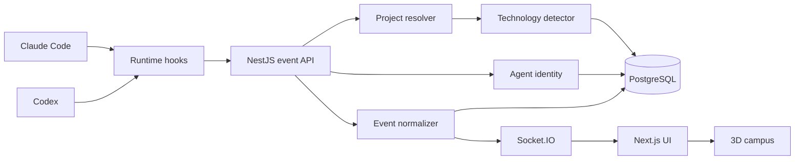

# Architecture

AI Virtual Campus is a pnpm/Turbo monorepo. The campus itself is TypeScript
(Next.js + NestJS), but that is an implementation detail of the campus — it never
imposes any requirement on the **monitored** projects, which can be written in any
language.

## Data flow



`POST /api/claude/events` or `POST /api/codex/events` → validate (zod) → resolve project (`project-inspector`) →
upsert project/session/agent → resolve the active agent → normalize
(`event-normalizer`) → persist `ClaudeEvent` (+ `ToolExecution` for tool calls) →
broadcast over Socket.IO. Orchestration lives in
`apps/api/src/events/events.service.ts`.

## Monorepo layout

```text
apps/
  api/     NestJS backend: event pipeline, Prisma/Postgres, Socket.IO gateway
  web/     Next.js + React Three Fiber frontend
packages/
  contracts/          zod schemas, shared TS types, 3D layout + agent identity constants
  project-inspector/  git identity resolution + technology detection (pure)
  event-normalizer/   command/file classification, redaction, normalization (pure)
  claude-plugin/      Claude/Codex hook scripts + dual installer/uninstaller (legacy package name)
  config-eslint/      shared eslint config
  config-typescript/  shared tsconfig base
scripts/
  demo-events.ts   PHP/Python/Go simulators over the real HTTP endpoint
  screenshots.ts   captures docs/images/*.png from a real browser
  e2e-smoke.ts     full-stack smoke test
  redesign-smoke.ts headless-browser UI smoke test
```

## Boundaries

- `packages/contracts` — zod schemas + shared types + layout/identity constants. Both
  `apps/api` and `apps/web` depend on it; neither depends on the other. `apps/web`
  imports its TS source via Next.js `transpilePackages`; every other consumer imports
  the built `dist/`.
- `packages/project-inspector` — pure functions: git identity (`execFile` only, never
  shell interpolation), technology detection, module detection. No NestJS/Prisma types.
- `packages/event-normalizer` — pure functions: command/file classification, secret
  redaction, hook-payload normalization. No I/O.
- `apps/api` — NestJS. Domain modules are thin adapters over the two packages above plus
  Prisma. Realtime only ever emits normalized event / agent-state shapes; raw hook
  payloads are never forwarded to the frontend.
- `apps/web` — Next.js + React Three Fiber. All agent movement/animation is driven by
  agent state from the backend; the only client-generated motion is the clearly-labelled
  [ambient idle life](../README.md#idle-campus-life), which never produces events.

## The five visual states

The frontend (`apps/web/selectors/`) collapses detailed backend activity into five visual
states, so agents move on meaningful phase changes rather than on every tool call:

| Visual state | Backend activity (examples) | Where the agent goes |
|---|---|---|
| Planning | UserPromptSubmit, planning, meeting | planning table |
| Working | Read/Grep/Edit/Write, commands, db/infra edits | assigned desk |
| Checking | test, build, lint, typecheck, review | shared review screen |
| Attention | permission request, blocked, tool failure | pauses in place + beacon |
| Completed | task complete / successful stop | desk (brief celebrate) → idle |

## Agent identity resolution

Claude Code hooks fire process-wide, not per-subagent, so there is no dedicated subagent
identifier in a payload. The campus infers the active agent from `Task` PreToolUse and
`SubagentStop`, preferring the most recently active teammate in that session.

A subagent's stable identity is keyed on `(session + agentType)`, so re-running the same
kind of subagent — or reconnecting after a restart — reuses the same teammate (same name,
same desk) instead of spawning a duplicate. Each teammate is assigned a readable name from
a curated pool (deterministic, no duplicates within a project) plus a role and short bio
from `packages/contracts/src/agents.ts`. See [hooks.md](hooks.md) for the hook-event
mapping this depends on.

Codex provides native `SubagentStart`/`SubagentStop` hooks with explicit `agent_id` and
`agent_type`, so those identities are direct. Sessions are keyed by `(runtime,
externalSessionId)`, allowing Claude and Codex to use the same external id without a
collision. Main agents are distinct (`main-claude` and `main-codex`) when both runtimes
operate in the same project.

## Project & module routing

Project identity = normalized git remote URL if present, else the worktree-resolved
absolute repository root, else the raw working directory for non-git projects — never the
detected language. Routing key is `projectId + sessionId + agentId`. Nested applications
inside a monorepo become `ProjectModule`s under the same room, not separate rooms.
